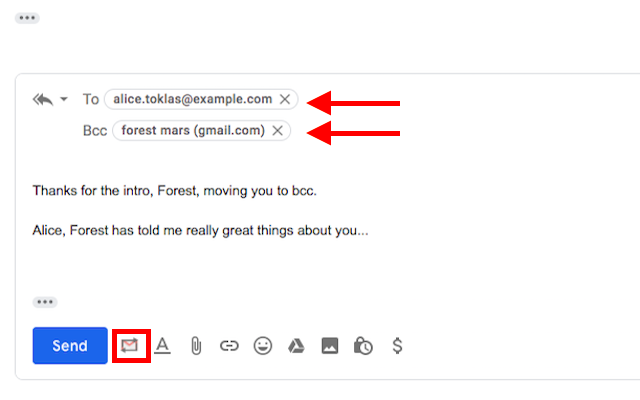

# Switcheroo for Gmail

Reply to Intro emails with Switcheroo: Moves 'From:'' address to 'BCC:' and other recipients into the 'To:' field.

Switcheroo makes replying to "Intro" emails a breeze. With one click it moves the sender to the Bcc: field, and moves other recipient/s into the To: field. 

No more dragging or cutting/pasting or manually moving email addresses around: Switcheroo does this for you in a single click. 

Based on a suggestion by Murat Aktihanoglu.
